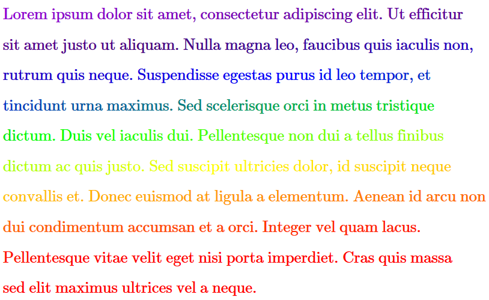

# rainbow-posting

Creates rainbow colored text (currently only for TeX (specifically mathJAX with colors enabled)--but other markup languages are easily added) at any width while still showing the full spectrum.

## anything from a condensed rainbow (missing colors)


## …to an entire word wrapped paragraph



## Usage

```
    $ git clone https://github.com/zelcon5/rainbow-posting
    $ cd rainbow-posting
    $ lein run "My text here"
```

## License

GNU GPL v3